# Load Balancing Solution using NGINX and SSL/TLS

In project 8, we configured a load balancer uisng apache2 to distribute the traffic between the web servers to ensure horixontal scalability. In this project, we will configure an Nginx load balancer solution. 

Both Nginx and Apache are powerful and widely used web servers, but they have different strengths and weaknesses. Nginx is often preferred over Apache as a load balancer due to its efficiency, simplicity, and ability to handle heavy loads and high concurrency. Its event-driven architecture makes it ideal for use in high-traffic websites or applications. It also has excellent support for SSL/TLS termination and is known for its ability to perform reverse proxying and load balancing. While Apache can also act as a reverse proxy and load balancer, Nginx is generally considered more efficient and scalable for these tasks.

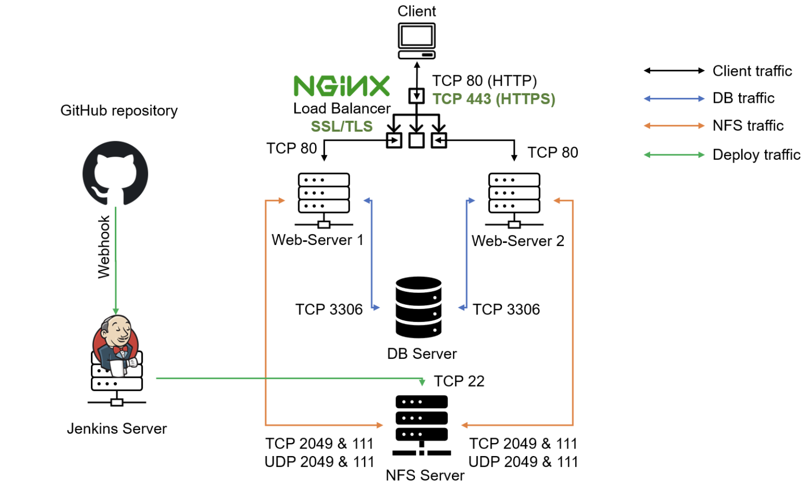

It is also extremely important to ensure that connections to your Web solutions are secure and information is encrypted in transit. In this project, we will also cover connection over secured HTTP (HTTPS protocol), its purpose and what is required to implement it.

[SSL and its newer version, TSL](https://en.wikipedia.org/wiki/Secure_Sockets_Layer) – is a security technology that protects connection from MITM attacks by creating an encrypted session between browser and Web server. Here we will refer this family of cryptographic protocols as SSL/TLS – even though SSL was replaced by TLS, the term is still being widely used.

SSL/TLS uses [digital certificates](https://en.wikipedia.org/wiki/Public_key_certificate) to identify and validate a Website. A browser reads the certificate issued by a [Certificate Authority (CA)](https://en.wikipedia.org/wiki/Certificate_authority) to make sure that the website is registered in the CA so it can be trusted to establish a secured connection.

There are different types of SSL/TLS certificates – you can learn more about them [here](https://blog.hubspot.com/marketing/what-is-ssl). You can also watch a tutorial on how SSL works here or an additional resource [here](https://youtu.be/SJJmoDZ3il8)

In this project you will register your website with [LetsEnrcypt](https://letsencrypt.org/) Certificate Authority, to automate certificate issuance you will use a shell client recommended by LetsEncrypt – [cetrbot](https://certbot.eff.org/).

__NB__ Read about Reverse proxy

__To read more about HTTP load balancing methods and features supported by Nginx on this [page](https://docs.nginx.com/nginx/admin-guide/load-balancer/http-load-balancer/)__

__Objectives__

1. Configure Nginx as a Load Balancer
1. Register a new domain name and configure secured connection using SSL/TLS certificates

__Step 1: Replicate the setup for project 9.__

__Step 2: Configure Nginx as a Load Balancer__

1. Uninstall Apache from the existing Load Balancer server.

```SHELL
# Stop the Apache service:
sudo service apache2 stop
# Remove the Apache package:
sudo apt-get remove apache2 -y
# Remove the Apache package:
sudo apt-get purge apache2 -y
# Restart the server to ensure that Apache is completely removed:
sudo reboot
```
2. Open TCP port 80 for HTTP connections, also open TCP port 443 for secured HTTPS connections.

3. Update "/etc/hosts" file for local DNS with Web Servers’ names (e.g. Web1 and Web2) and their local IP addresses

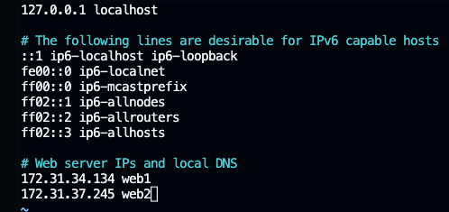

4. Install and configure Nginx as a load balancer to point traffic to the resolvable DNS names of the webservers

```SHELL
sudo apt update
sudo apt install nginx -y
```

Configure Nginx LB using Web Servers’ names defined in /etc/hosts. Open the default nginx configuration file "sudo vi /etc/nginx/nginx.conf" and add the below text.

```SHELL
#insert following configuration into http section

 upstream myproject {
    server Web1 weight=5;
    server Web2 weight=5;
  }

server {
    listen 80;
    server_name www.domain.com;
    location / {
      proxy_pass http://myproject;
    }
  }

#comment out this line
#       include /etc/nginx/sites-enabled/*;
```

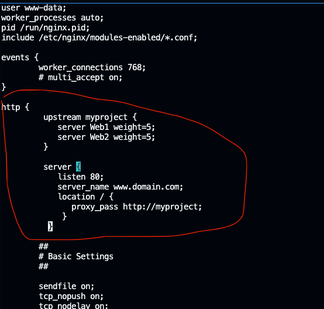

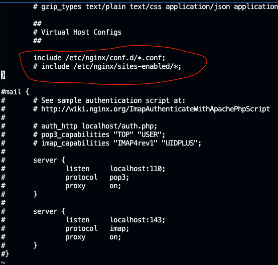


Hint: Read this [blog](https://linuxize.com/post/how-to-edit-your-hosts-file/) to read about /etc/host

Restart Nginx and make sure the service is up and running

```SHELL
sudo systemctl restart nginx
sudo systemctl status nginx
```

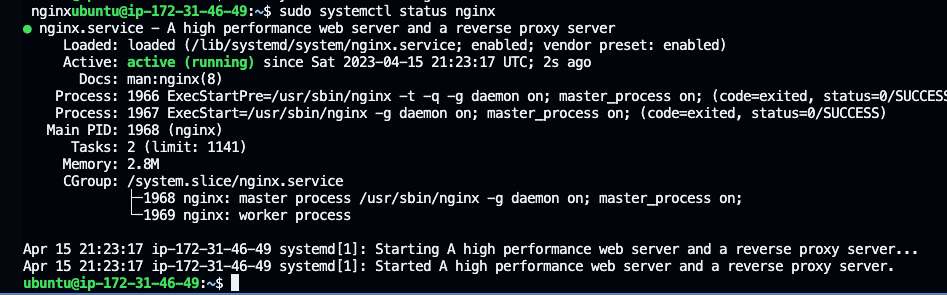

__Step 3: REGISTER A NEW DOMAIN NAME AND CONFIGURE SECURED CONNECTION USING SSL/TLS CERTIFICATES__

We need a valid ssl certificate and to get this we need to register a new domain name.

1. Register a new domain name with any registrar of your choice in any domain zone

- Choose a registrar: There are many domain registrars to choose from, such as GoDaddy, Namecheap, and Google Domains. In will be using GoDaddy.
- Check domain availability
- Choose a domain name
- Provide your details
- Review and confirm

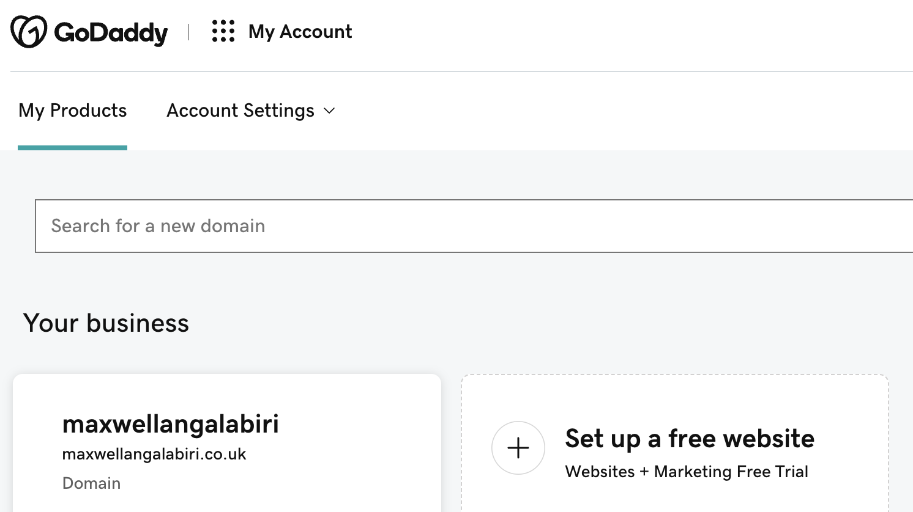

2. Assign an Elastic IP to your Nginx LB server and associate your domain name with this Elastic IP

- On the Ec2 menu, click on "Elastic Ip" then click on "Allocate Elastic IP Address" to create and EIP.
- Click on "Actions" dropdown and select "Associate Elastic IP Address". Enter the following:

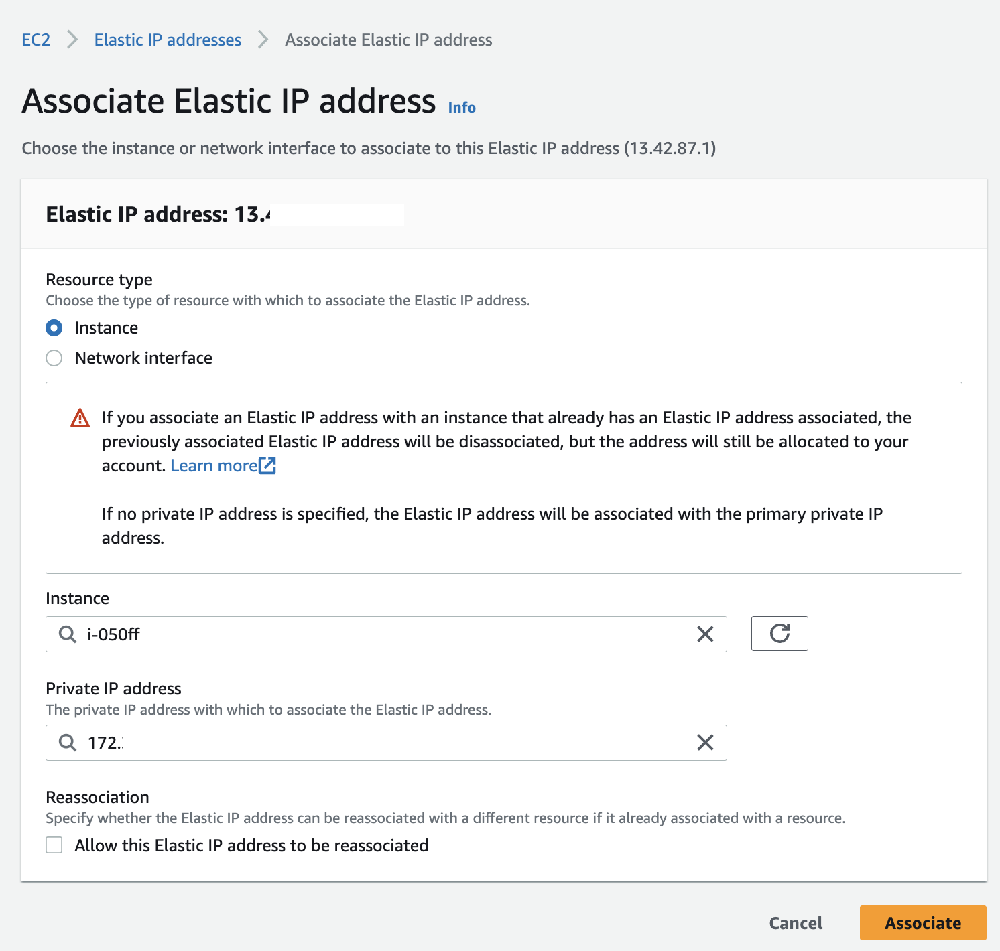

3. Update A record in your registrar to point to Nginx LB using Elastic IP address

- Go to GoDaddy’s Domain Manager
- Go to the Manage DNS of the domain you are integrating
- Replace the Value of record with Type A with the elastic IP you just created.
- Wait for changes to reflect (This takes at least 600 seconds to reflect, depending on the TTL you specified).
- To check if successful, the domain should now load the EC2 instance you pointed it too.

Check that your Web Servers can be reached from your browser using new domain name using HTTP protocol – http://<your-domain-name.com>

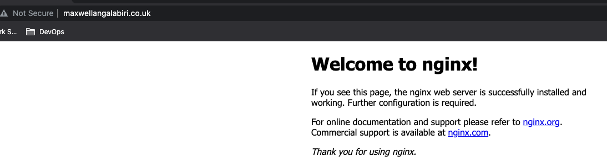

4. Configure Nginx to recognize your new domain name by updating nginx.conf with server_name www.<your-domain-name.com> instead of server_name www.domain.com

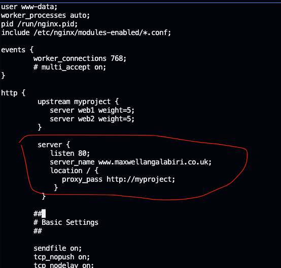

5. Install certbot and request for an SSL/TLS certificate Make sure snapd service is active and running

```SHELL
sudo systemctl status snapd
```
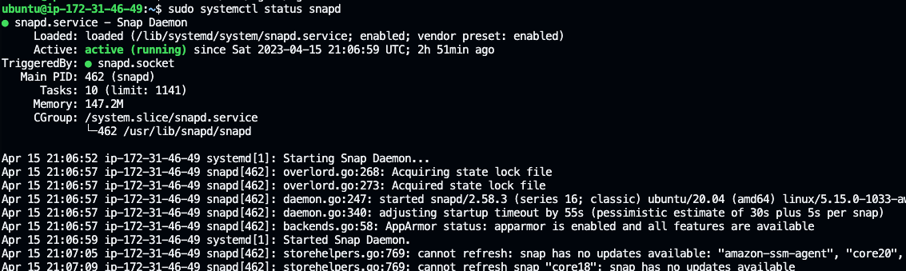

Install certbot

```SHELL
sudo snap install --classic certbot
```

Request your certificate (just follow the certbot instructions – you will need to choose which domain you want your certificate to be issued for, domain name will be looked up from nginx.conf file so make sure you have updated it on step 4).

```SHELL
sudo ln -s /snap/bin/certbot /usr/bin/certbot
sudo certbot --nginx
```

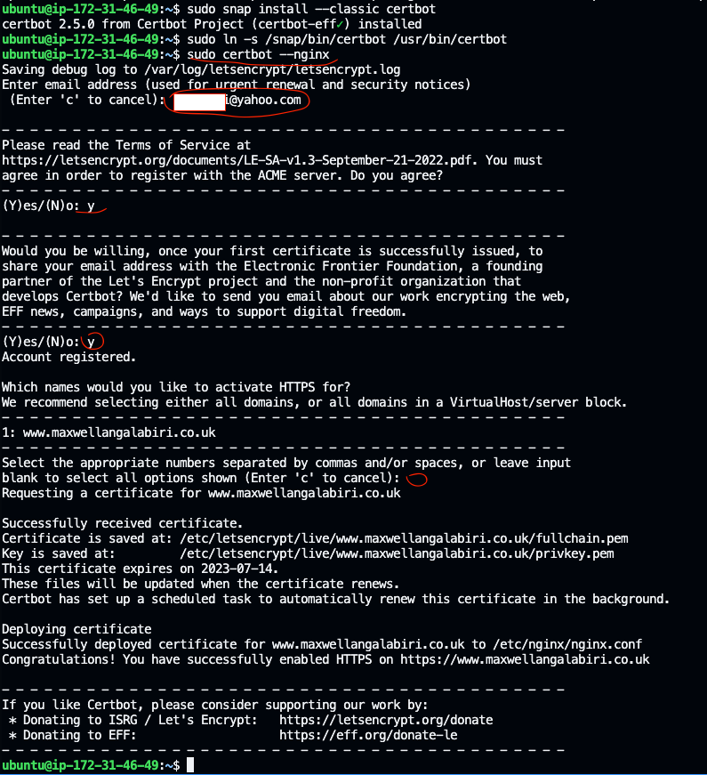

Ensure HTTPS Port 443 is open and Test secured access to your Web Solution by trying to reach https://<your-domain-name.com>

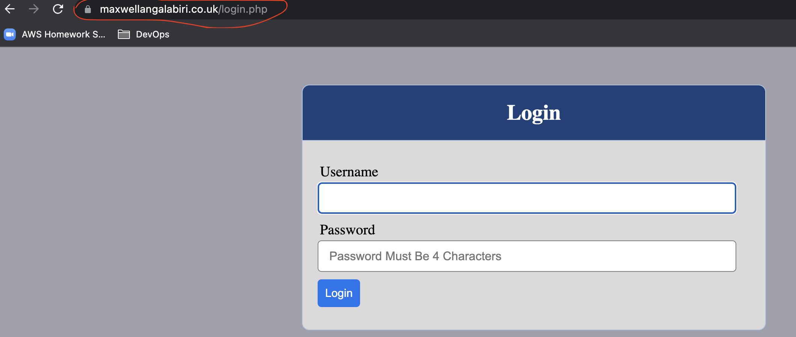

The padlock sign close to the url shows that the website is now secure.

Click on the padlock icon and you can see the details of the certificate issued for your website.

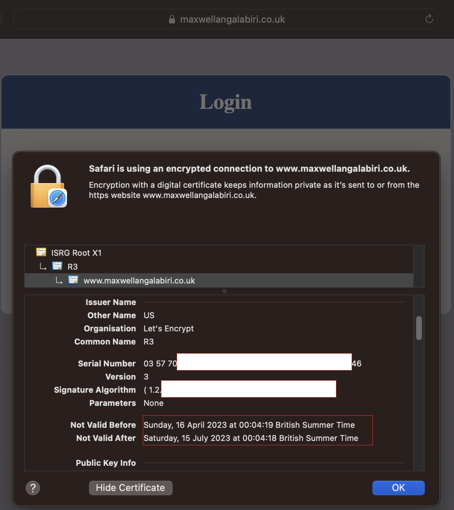

6. Set up periodical renewal of your SSL/TLS certificate

By default, LetsEncrypt certificate is valid for 90 days, so it is recommended to renew it at least every 60 days or more frequently.

You can test renewal command in dry-run mode

```SHELL
sudo certbot renew --dry-run
```

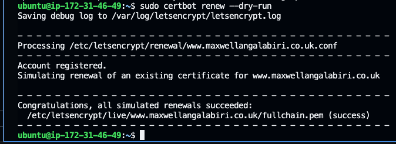

Best pracice is to have a scheduled job that to run renew command periodically. Let us configure a cronjob to run the command twice a day.

To do so, lets edit the crontab file with the following command:

```SHELL
crontab -e
```
Add the below line to the end of this crontab file:
```SHELL
* */12 * * *   root /usr/bin/certbot renew > /dev/null 2>&1
```

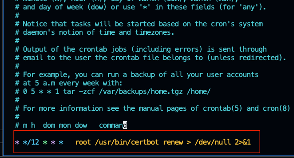

You can always change the interval of this cronjob if twice a day is too often by adjusting schedule expression.

Refresh your cron configuration knowledge by watching [this video](https://youtu.be/4g1i0ylvx3A)

You can also use this handy [online cron expression editor](https://crontab.guru/).

__Conclusion__

An Nginx Load balancing web solution with a custom dns name, and a secured HTTPS connection with periodically renewal of ssl/tls certificate have been successfully configured for our devops tooling website.

__CREDIT__

[Darey.io DevOps Master Class](darey.io)


