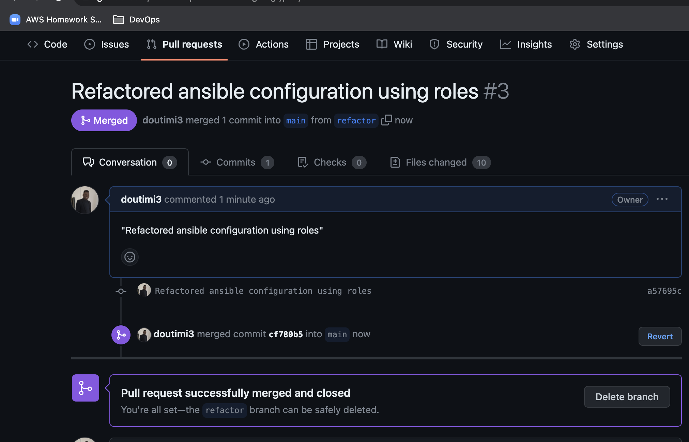

# ANSIBLE REFACTORING AND STATIC ASSIGNMENTS (IMPORTS AND ROLES)

In this project you will continue working with ansible-config-mgt repository and make some improvements of your code. Now you need to refactor your Ansible code, create assignments, and learn how to use the imports functionality. Imports allow to effectively re-use previously created playbooks in a new playbook – it allows you to organize your tasks and reuse them when needed.

__Code Refactoring__
Refactoring is a general term in computer programming. It means making changes to the source code without changing expected behaviour of the software. The main idea of refactoring is to enhance code readability, increase maintainability and extensibility, reduce complexity, add proper comments without affecting the logic.

__Step 1: Jenkins job enhancement__

In the present setup from project 11, every new change in the codes creates a separate directory which is not very convenient when we want to run some commands from one place. Besides, it consumes space on Jenkins serves with each subsequent change. Let us enhance it by introducing a new Jenkins project/job – we will require Copy Artifact plugin.

1. Go to your Jenkins-Ansible server and create a new directory called ansible-config-artifact – we will store there all artifacts after each build.
```SHELL
sudo mkdir ~/ansible-config-artifact
```

2. Change permissions to this directory, so Jenkins could save files there
```SHELL
chmod -R 0777 ~/ansible-config-artifact
```

3. Go to Jenkins web console -> Manage Jenkins -> Manage Plugins -> on Available tab search for "Copy Artifact" and install this plugin without restarting Jenkins

4. Create a new Freestyle project and name it save_artifacts.


5. This project will be triggered by completion of your existing ansible project. Configure it accordingly:


6. The main idea of save_artifacts project is to save artifacts into /home/ubuntu/ansible-config-artifact directory. To achieve this, create a Build step and choose Copy artifacts from other project, specify ansible as a source project and /home/ubuntu/ansible-config-artifact as a target directory.


7. Test your set up by making some change in README.MD file inside your ansible-config-mgt repository (right inside main branch). If both Jenkins jobs have completed one after another – you shall see your files inside /home/ubuntu/ansible-config-artifact directory and it will be updated with every commit to your main branch.


Now the Jenkins pipeline is more neat and clean.

__Step 2: Refactor Ansible code by importing other playbooks into site.yml__

Before starting to refactor any codes, ensure that you have pulled down the latest code from main branch, and created a new branch, name it refactor.

In Project 11 you wrote all tasks in a single playbook common.yml, now it is pretty simple set of instructions for only 2 types of OS, but imagine you have many more tasks and you need to apply this playbook to other servers with different requirements. In this case, you will have to read through the whole playbook to check if all tasks written there are applicable and is there anything that you need to add for certain server/OS families. Very fast it will become a tedious exercise and your playbook will become messy with many commented parts. Your DevOps colleagues will not appreciate such organization of your codes and it will be difficult for them to use your playbook.

Most Ansible users learn the one-file approach first. However, breaking tasks up into different files is an excellent way to organize complex sets of tasks and reuse them.

This will be achieved by making the code reusable using the following approach:

1. Within playbooks folder, create a new file and name it site.yml – This file will now be considered as an entry point into the entire infrastructure configuration. Other playbooks will be included here as a reference. In other words, site.yml will become a parent to all other playbooks that will be developed. Including common.yml that you created previously. Dont worry, you will understand more what this means shortly.

2. Create a new folder in root of the repository and name it static-assignments. The static-assignments folder is where all other children playbooks will be stored. This is merely for easy organization of your work. It is not an Ansible specific concept, therefore you can choose how you want to organize your work. You will see why the folder name has a prefix of static very soon. For now, just follow along.

3. Move common.yml file into the newly created static-assignments folder.


```SHELL
cd playbooks 
touch site.yaml
mkdir ../static-assignments
cd ..
mv playbooks/common.yaml static-assignments 
vi playbooks/site.yaml 
```
2. Inside site.yml file, import common.yml playbook by adding the below lines to site.yaml to use the [import_playbook](https://docs.ansible.com/ansible/latest/collections/ansible/builtin/import_playbook_module.html) Ansible module.

```SHELL
---
- hosts: all
- import_playbook: ../static-assignments/common.yaml
```


5. Run ansible-playbook command against the dev environment

Since I need to apply some tasks to your dev servers and wireshark is already installed, I will create another playbook under static-assignments and name it common-del.yaml. In this playbook, I will configure deletion of wireshark utility.

```SHELL
touch static-assignments/common-del.yaml
```
Add the below code

```SHELL
---
- name: update web, and nfs server
  hosts: webgroup, nfsgroup
  become: yes

  tasks:
    - name: delete wireshark
      yum:
        name: wireshark
        state: removed

- name: update ALB and DB server
  hosts: dbgroup, albgroup
  become: yes

  tasks:
    - name: delete wireshark
      apt:
        name: wireshark-qt
        state: absent
        autoremove: yes
        purge: yes
        autoclean: yes
```

update site.yaml with - import_playbook: ../static-assignments/common-del.yaml instead of common.yaml and run it against dev servers:

```SHELL
cd /home/ubuntu/ansible-config-mgt/
ansible-playbook -i inventory/inventory_dev playbooks/site.yaml
```


Make sure that wireshark is deleted on all the servers by running wireshark --version


__Step 3: Configure UAT Webservers with a role "Webserver"__

We have our nice and clean dev environment, so let us put it aside and configure 2 new Web Servers as uat. We could write tasks to configure Web Servers in the same playbook, but it would be too messy, instead, we will use a dedicated role to make our configuration reusable.

1. Launch 2 fresh EC2 instances using RHEL 8 image, we will use them as our uat servers, so give them names accordingly – Web1-UAT and Web2-UAT.


2. To create a role, you must create a directory called roles/, in /home/ubuntu/ansible-config-mgt directory.

```SHELL
mkdir roles
cd roles
ansible-galaxy init webserver
cd webserver/ && rm -rf tests/ vars/ files/
```


3. Update the inventory ansible-config-mgt/inventory/inventory_uat.yml file with IP addresses of your 2 UAT Web servers

```SHELL
web-server1 ansible_host=<private ip>
web-server2 ansible_host=<private ip>

[uat_webgroup]
web-server1
web-server2

[uat_webgroup:vars]
ansible_user=ec2-user
ansible_ssh_private_key_file=~/ansible-config-mgt/DevOpsMasterClass_London.pem
```

4. In /etc/ansible/ansible.cfg file "sudo vi /etc/ansible/ansible.cfg" uncomment roles_path string and provide a full path to your roles directory roles_path    = /home/ubuntu/ansible-config-mgt/roles, so Ansible could know where to find configured roles.

__Note:__ Ansible.cfg file in the playbook directory have more priority than the one in the /etc/ directory so to keep all configurations easily accessible and local to this project I will be configuring the roles path in the ansible.cfg file in the present working directory (i.e., vi playbooks/ansible.cfg)

5. Add some logic to the webserver role. Go into tasks directory, and within the main.yml file, start writing configuration tasks to do the following:

* Install and configure Apache (httpd service)
* Clone Tooling website from GitHub https://github.com/<your-name>/tooling.git.
* Ensure the tooling website code is deployed to /var/www/html on each of 2 UAT Web servers.
* Make sure httpd service is started

```YAML
---
# tasks file for webserver
- name: install apache
  become: true
  yum:
    name: "httpd"
    state: present

- name: install git
  become: true
  yum:
    name: "git"
    state: present

- name: clone a repo
  become: true
  git:
    repo: https://github.com/doutimi3/devops_tooling.git
    dest: /var/www/html
    force: yes

- name: copy html content to one level up
  become: true
  command: cp -r /var/www/html/html/ /var/www/

- name: Start service httpd, if not started
  become: true
  ansible.builtin.service:
    name: httpd
    state: started

- name: recursively remove /var/www/html/html/ directory
  become: true
  ansible.builtin.file:
    path: /var/www/html/html
    state: absent
```

__Step 4: Reference ‘Webserver’ role__

Within the static-assignments folder, create a new assignment for uat-webservers uat-webservers.yml. This is where you will reference the role.

```SHELL
vi static-assignments/uat-webservers.yml
```
Add the below lines:

```YAML
---
- hosts: uat_webgroup
  roles:
     - webserver
```

Remember that the entry point to our ansible configuration is the site.yml file. Therefore, you need to refer your uat-webservers.yml role inside site.yml. The below lines should be entered into site.yml (i.e., vi playbooks/site.yaml)

```SHELL
---
- hosts: all
- import_playbook: ../static-assignments/common.yaml

- hosts: uat_webgroup
- import_playbook: ../static-assignments/uat-webservers.yml
```

__Step 5: Commit & Test__

Now run the playbook against your uat inventory and see what happens:

```SHELL
cd /home/ubuntu/ansible-config-mgt/
ansible-playbook -i inventory/inventory_uat playbooks/site.yaml
```


Commit your changes, create a Pull Request and merge them to master branch, make sure webhook triggered two consequent Jenkins jobs, they ran successfully and copied all the files to your Jenkins-Ansible server into /home/ubuntu/ansible-config-mgt/ directory.




View website in web browser:


The present architecture is shown below:


__Conclusion__

We have successfully configured and deployed ansible configurations to the UAT web servers and got the website up on the browser from our UAT environment.

__CREDIT__

[Darey.io DevOps Master Class](darey.io)


