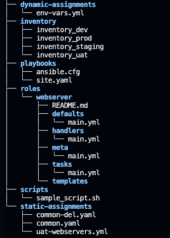
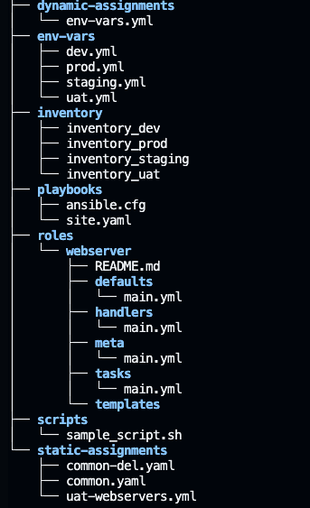
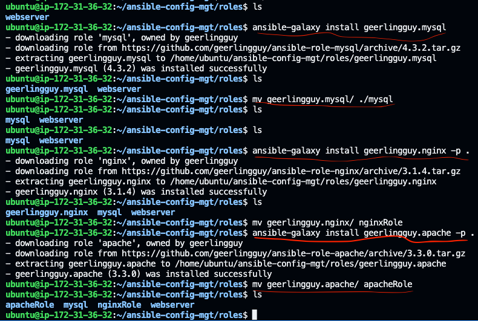

# ANSIBLE DYNAMIC ASSIGNMENTS (INCLUDE) AND COMMUNITY ROLES

In this project you will continue working with ansible-config-mgt repository and make some improvements of your code. In the last project, we have learnt how to use the ansible import module and roles to configure the UAT servers. In this project, the concept of dynamic assisgnment will be introduced and I will continue working on configuring the UAT servers using dynamic assignment (the ansible "include" module) which would be used Include roles, tasks, or variables to a playbook dynamically. 

Ansible processes included files and roles as they come up in a playbook, so included tasks can be affected by the results of earlier tasks within the top-level playbook. Included roles and tasks are similar to handlers - they may or may not run, depending on the results of other tasks in the top-level playbook.

Importing roles, tasks, or playbooks adds them to a playbook statically. Ansible pre-processes imported files and roles before it runs any tasks in a playbook, so imported content is never affected by other tasks within the top-level playbook.

In most cases, it is recommended to use static assignments for playbooks, because it is more reliable. With dynamic ones, it is hard to debug playbook problems due to its dynamic nature. However, you can use dynamic assignments for environment specific variables as we will be introducing in this project.

__STEP 1: Introducing Dynamic Assignment the Project structure__

1. In ansible-config-mgt github repository created in the previous project, create a new branch called "dynamic-assignments"

2. Create a new folder called "dynamic-assignments". Then inside this folder, create a new file called "env-vars.yml". We will instruct site.yml to include this playbook later. The presnt directory structure is shown below:



3. Create a new folder "env-vars" to store environment specific variables, then for each environment, create new YAML files which we will use to set variables. The present layout is shown below:



4. Now paste the instruction below into the env-vars.yml file.

```YAML
---
- name: collate variables from env specific file, if it exists
  hosts: all
  tasks:
    - name: looping through list of available files
      include_vars: "{{ item }}"
      with_first_found:
        - files:
            - dev.yml
            - staging.yml
            - prod.yml
            - uat.yml
          paths:
            - "{{ playbook_dir }}/../env-vars"
      tags:
        - always
```

Notice 3 things to notice here:

* We used include_vars syntax instead of include, this is because Ansible developers decided to separate different features of the module. From Ansible version 2.8, the include module is deprecated and variants of include_* must be used. These are:
    * include_role
    * include_tasks
    * include_vars

In the same version, variants of import were also introduces, such as:

    * import_role
    * import_tasks

* We made use of a special variables { playbook_dir } and { inventory_file }. { playbook_dir } will help Ansible to determine the location of the running playbook, and from there navigate to other path on the filesystem. { inventory_file } on the other hand will dynamically resolve to the name of the inventory file being used, then append .yml so that it picks up the required file within the env-vars folder.

* We are including the variables using a loop. with_first_found implies that, looping through the list of files, the first one found is used. This is good so that we can always set default values in case an environment specific env file does not exist.

__STEP 2: UPDATE SITE.YML WITH DYNAMIC ASSIGNMENTS__

1. Update site.yml file to make use of the dynamic assignment. Open the file and add the below line of codes:

```YAML
---
- hosts: all
- name: Include dynamic variables 
  tasks:
  import_playbook: ../static-assignments/common.yml 
  include: ../dynamic-assignments/env-vars.yml
  tags:
    - always

-  hosts: webservers
- name: Webserver assignment
  import_playbook: ../static-assignments/webservers.yml
```

2. Create a role for MySQL database – it should install the MySQL package, create a database and configure users. For this we will be using an already devoloped, production role that is available in ansible-galaxy. 

    The are already tons of available roles roles [here](https://galaxy.ansible.com/home). We will use [MySQL role developed by heerlingguy](https://galaxy.ansible.com/geerlingguy/mysql)

    ```SHELL
    ansible-galaxy install geerlingguy.mysql
    cd ~/Desktop/DevOpsMasterClass/ansible-config-mgt/roles
    mv geerlingguy.mysql/ ./mysql

    ```


3. Commit and push code to github and pull back changes from remote to local.

4. Inside roles directory create your new MySQL role with ansible-galaxy install geerlingguy.mysql and rename the folder to mysql.

5. Read README.md file, and edit roles configuration to use correct credentials for MySQL required for the tooling website.


6. Upload changes to github.

```SHELL
git add .
git commit -m "Commit new role files into GitHub"
git push --set-upstream origin roles-feature
```

7. Create a pull request and merge changes to main branch.

__STEP 3: LOAD BALANCER ROLES__

1. Launch an Ubuntu instance to serve as the load balancer server and update the inventory_uat file with the details of this instance. The inventory_uat file now looks like:

```YAML
# Hosts Private IPs
web-server1 ansible_host=172.31.41.69
web-server2 ansible_host=172.31.35.236
lb ansible_host=172.31.45.251

[uat_webgroup]
web-server1
web-server2

[uat_lbgroup]
lb

[uat_lbgroup:vars]
ansible_user=ubuntu
ansible_ssh_private_key_file=~/ansible-config-mgt/keypair.pem

[uat_webgroup:vars]
ansible_user=ec2-user
ansible_ssh_private_key_file=~/ansible-config-mgt/keypair.pem
```

1. We want to be able to choose which Load Balancer to use, Nginx or Apache, so we need to have two roles respectively and devolop both roles from scrtach or use already available roles:

* Nginx
* Apache

I will be using an already available role so inside the roles directory, I will create a new MySQL role with ansible-galaxy install geerlingguy.nginx -p . and rename the folder to nginxRole.

```SHELL
ansible-galaxy install geerlingguy.nginx -p .
mv geerlingguy.nginx/ nginxRole
```

Inside roles directory create your new MySQL role with ansible-galaxy install geerlingguy.apache -p . and rename the folder to apacheRole.

```SHELL
ansible-galaxy install geerlingguy.apache -p .
mv geerlingguy.apache/ apacheRole
```



2. Update both static-assignment and site.yml files to refer the roles

__Important Hints:__

* Since you cannot use both Nginx and Apache load balancer, use a variable to indicate your preferred load balancer.

* Declare a variable in defaults/main.yml file inside the Nginx and Apache roles. Name each variables enable_nginx_lb and enable_apache_lb respectively and set both values to false (i.e., enable_nginx_lb: false and enable_apache_lb: false).

* Declare another variable in both roles load_balancer_is_required and set its value to false as well

* Update both assignment and site.yml files respectively

__loadbalancers.yml file__

```YAML
- hosts: lb
  roles:
    - { role: nginx, when: enable_nginx_lb and load_balancer_is_required }
    - { role: apache, when: enable_apache_lb and load_balancer_is_required }
```

__site.yml file__

```YML
- name: Loadbalancers assignment
  hosts: uat_lbgroup
  tasks:
     - import_playbook: ../static-assignments/loadbalancers.yml
       when: load_balancer_is_required

```
3. Now you can make use of env-vars\uat.yml file to define which loadbalancer to use in UAT environment by setting respective environmental variable to true. I will activate load balancer, and enable nginx by setting these in the respective environment’s env-vars file.

```YAML
enable_nginx_lb: true
load_balancer_is_required: true
```

__NB:__ The same must work with apache LB, so you can switch it by setting respective environmental variable to true and other to false.

4. To test this, you can update inventory for each environment and run Ansible against each environment.

```SHELL
ansible-playbook -i inventory/uat.yml playbooks/site.yaml
```

__CONCLUSION__

We have successfully learnt how use dynamic variables and configure load balancer in our tooling website using ansible roles and dynamic variable.


