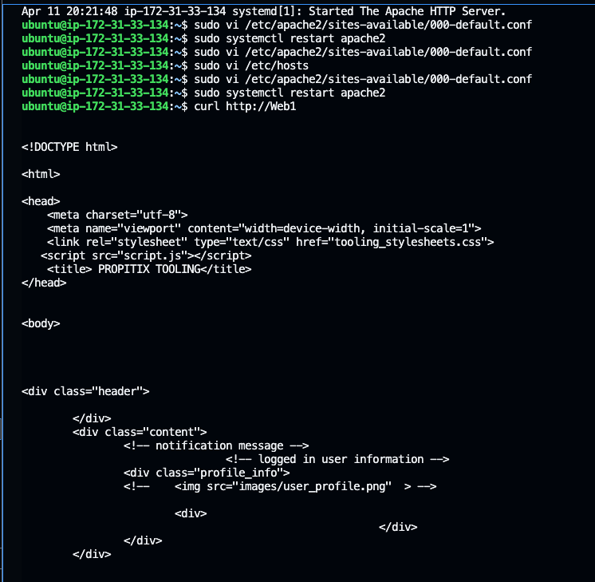

# LOAD BALANCER SOLUTION WITH APACHE

In Project-7 web set up three webservers and the website is served from these three servers seperately so users will be required to access the website using three different public IP addresses. This is not an ideal set up because it is not scalable, so in this project we will introduce a load balance to sit in front of the webservers to distribute the traffic between the webservers. The public IP or DNS name of this load balance would then become the single IP address to access the website which is hosted in multiple webservers. This would enable use easily scale the systems when there is an increased traffic with no downtime by adding more instances to cater for the increased traffic (Horizontal scalling) as opposes to upgrade the instance to a larger instance class (Vertical scaling) which would require a system downtime.

__Present Artitecture/Prerequisite:__

In Project-7, we implemented a solution that comprises three web servers sharing a common database and also accessing the same files using Network File System (NFS) as shared file storage. As a prerequisite for this roject, we need to ensure we replicate the same set up but we will only use two web servers in this case. The artitectural diagram of the required set up is show below


__Target Architecture__

We will make our present set up scalable by adding a load balancer in fron of the web servers and only expose the public IP of this load balancer. This will make the system very scalable and secure.


Step 1: Replicate Project 7 Set up:

__Web Server 1 Running__


__Webservers mounted to /mnt/apps of NFS server__


__All Necessary TCP/UDP Ports Opened__

__NFS-Server__


__Web Server__


__DB Server__


__Website accessible on web browser__


__Step 2: Configure Apache as Load Balancer__

1. Launch an Ubuntu instance to host the ALB:


2. Open TCP port 80 on Project-8-apache-lb by creating an Inbound Rule in Security Group.

3. Install Apache Load Balancer on Project-8-apache-lb server and configure it to point traffic coming to LB to both Web Servers and Make sure apache2 is up and running:

```SHELL
#Install apache2
sudo apt update 
sudo apt install apache2 -y
sudo apt-get install libxml2-dev -y

#Enable following modules:
sudo a2enmod rewrite
sudo a2enmod proxy
sudo a2enmod proxy_balancer
sudo a2enmod proxy_http
sudo a2enmod headers
sudo a2enmod lbmethod_bytraffic

#Restart apache2 service
sudo systemctl restart apache2
```
Ensure Apache is up and running

```SHELL
sudo systemctl status apache2
```


Configure load balancing
We will be using "bytraffic load balancing method" to distribute the traffic between the web servers. The values in the "loadfactor" parameter controls the proportion of the traffic sent to each of the web servers. In this project we will configure this to evenly spread the traffic across the instances. This will be done by editting the configuration file "/etc/apache2/sites-available/000-default.conf" to add the below texts:

```SHELL
<Proxy "balancer://mycluster">
               BalancerMember http://<WebServer1-Private-IP-Address>:80 loadfactor=5 timeout=1
               BalancerMember http://<WebServer2-Private-IP-Address>:80 loadfactor=5 timeout=1
               ProxySet lbmethod=bytraffic
               # ProxySet lbmethod=byrequests
        </Proxy>

        ProxyPreserveHost On
        ProxyPass / balancer://mycluster/
        ProxyPassReverse / balancer://mycluster/
```


Restart Apache server

```SHELL
sudo systemctl restart apache2
```

4. Verify that our configuration works – try to access your LB’s public IP address or Public DNS name from your browser:


Open up the log file for each web server and refresh the website multiple times to ensure that each server is receiving equal amount of traffic:

```SHELL
sudo tail -f /var/log/httpd/access_log
```


__Optional Step – Configure Local DNS Names Resolution__

Edit the /etc/hosts file to configure the local DNS resolution. This is local to the instance alone and its only used to illustrate the concept. Open up the file using "sudo vi /etc/hosts" and add the below texts:

```SHELL
<WebServer1-Private-IP-Address> Web1
<WebServer2-Private-IP-Address> Web2
```


Update the load balancer configuration file to reflecxt the above changes

```SHELL
sudo vi /etc/apache2/sites-available/000-default.conf
```

```SHELL
BalancerMember http://Web1:80 loadfactor=5 timeout=1
BalancerMember http://Web2:80 loadfactor=5 timeout=1
```


Curl web server:



__Conclusion__

We have successfully implemented a Load balancing Web Solution for your DevOps team that evenly distributes the traffic across the available web servers. this way we can easily scale the system when there is an increased traffic and also ensure that the system is very secure by limiting the origin of traffic to the web servers to only be from the load balancer.

__Credit__

[Darey.io DevOps Master Class](darey.io)


