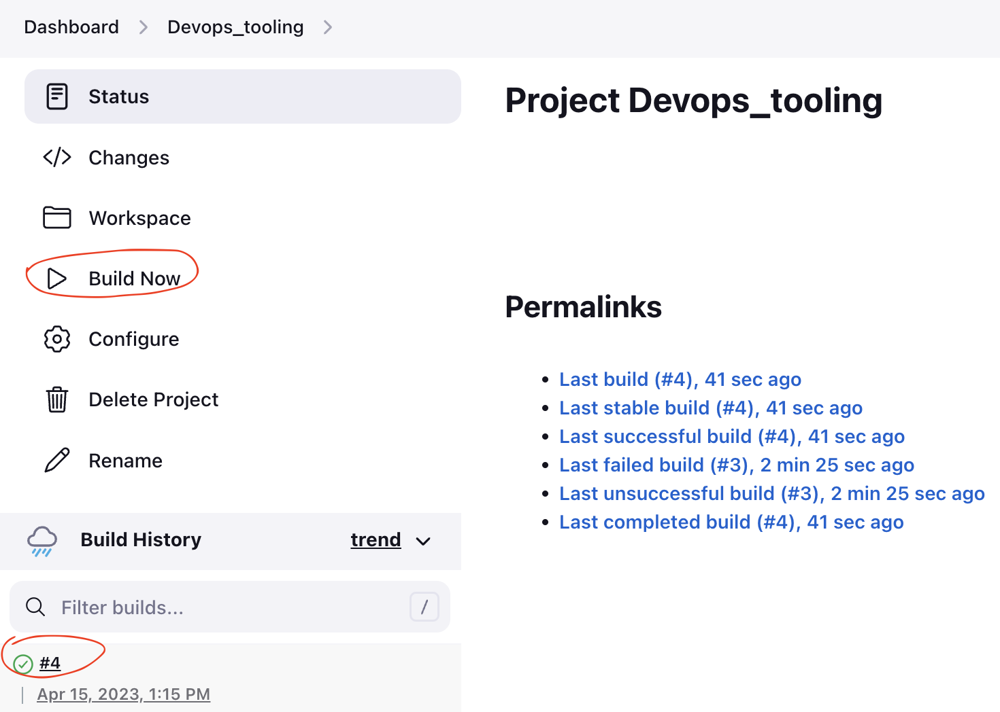

# TOOLING WEBSITE DEPLOYMENT AUTOMATION WITH CONTINUOUS INTEGRATION

In Project 8 the concept of horizontal scalability was introduced, which allow us to add new Web Servers to our Tooling Website and successfully deployed a set up with 2 Web Servers and also a Load Balancer to distribute traffic between them. If it is just two or three servers – it is not a big deal to configure them manually. Imagine that you would need to repeat the same task over and over again adding dozens or even hundreds of servers. This would not be an agile approach and it would involve a lot of manual work. DevOps is about agility, and speedy release of software and web solutions and one way this can be achieved is automation of routine tasks.

In this project I will be automating part of our routine tasks with a free and open source automation server – Jenkins, which is one of the most popular CI/CD tools.

__Continuous Integration (CI):__ is a DevOps software development practice where developers regularly merge their code changes into a central repository, after which automated builds and tests are run. Continuous integration most often refers to the build or integration stage of the software release process and entails both an automation component (e.g. a CI or build service) and a cultural component (e.g. learning to integrate frequently). The key goals of continuous integration are to find and address bugs quicker, improve software quality, and reduce the time it takes to validate and release new software updates.

In this project, I am going to utilize Jenkins CI capabilities to make sure that every change made to the source code in GitHub https://github.com/doutimi3/devops_tooling will be automatically be updated to the Tooling Website.

__Architecture/Prerequisite__

In this project, we will enhance the architecture of project 8 by adding a jenkins server, configuring a job to automatically deploy source codes changes from git to NFS Server. So the prerequisite for this project is to repeat the set up of project 8.

The architecture of this project is shown below:


__Step 1: Follow the steps in [Project 7 Documentation](https://github.com/doutimi3/DevOps_Projects/blob/main/Project-8/Project8.md) and [Project 8 Documentation](https://github.com/doutimi3/DevOps_Projects/blob/main/Project-8/Project8.md) to set up the nfs server, db server, web servers and mount the web server /var/www/ directory to the nfs-server and also set up a load balancer.

__Step 2: INSTALL AND CONFIGURE JENKINS SERVER__

1. Create an AWS EC2 server based on Ubuntu Server 20.04 LTS and name it "Jenkins"

2. Install JDK (since Jenkins is a Java-based application)
3. Install Jenkins
4. Make sure Jenkins is up and running

```SHELL
sudo apt update
# install openjdk and maven
sudo apt install openjdk-11-jdk -y
sudo apt install maven -y
# get repo to install jenkins
curl -fsSL https://pkg.jenkins.io/debian-stable/jenkins.io-2023.key | sudo tee \
  /usr/share/keyrings/jenkins-keyring.asc > /dev/null
echo deb [signed-by=/usr/share/keyrings/jenkins-keyring.asc] \
  https://pkg.jenkins.io/debian-stable binary/ | sudo tee \
  /etc/apt/sources.list.d/jenkins.list > /dev/null

# Install jenkins
sudo apt-get update
sudo apt-get install jenkins -y
# jenkins status
sudo systemctl status jenkins
```


4. By default Jenkins server uses TCP port 8080 – open it by creating a new Inbound Rule in your EC2 Security Group


5. Perform initial Jenkins setup.
From your browser access http://13.40.77.199:8080/

You will be prompted to provide a default admin password, run the below command on your jenkins server to get this password.


```SHELL
sudo cat /var/lib/jenkins/secrets/initialAdminPassword
```

Then you will be asked which plugings to install – choose suggested plugins.


Once plugins installation is done – create an admin user and you will get your Jenkins server address. Take note of this url, in case your shutdown your server the server ip address would change but this jenkins url will not change so you will still need to access jenkins using this url.


The installation is completed!


__Step 3: Configure Jenkins to retrieve source codes from GitHub using Webhooks__

In this part, we will configure a simple Jenkins job/project. This job will will be triggered by GitHub webhooks and will execute a ‘build’ task to retrieve codes from GitHub and store it locally on Jenkins server.

1. Enable webhooks in your GitHub repository settings

On the Devops_tooling repository, click on "setting" and the "webhook", then "add webhook" and configure it as follow: 


2. Go to Jenkins web console, click "New Item" and create a "Freestyle project"


To connect your GitHub repository, you will need to provide its URL, you can copy from the repository itself and In configuration of your Jenkins freestyle project choose Git repository, provide there the link to your Tooling GitHub repository and credentials (user/password) so Jenkins could access files in the repository.


Save the configuration and let us try to run the build. For now we can only do it manually.
Click "Build Now" button, if you have configured everything correctly, the build will be successfull and you will see it under



3. Click "Configure" your job/project and add these two configurations

Configure triggering the job from GitHub webhook:


Configure "Post-build Actions" to archive all the files – files resulted from a build are called "artifacts".

- Click on "Add post-build-action"
- On the dropdown, click on "Archieve the Artifact"
- Under "Archieve file" enter **


Make some change in any file in your GitHub repository (e.g. README.MD file) and push the changes to the master branch.

You will see that a new build has been launched automatically (by webhook) and you can see its results – artifacts, saved on Jenkins server.


You have now configured an automated Jenkins job that receives files from GitHub by webhook trigger (this method is considered as ‘push’ because the changes are being ‘pushed’ and files transfer is initiated by GitHub). There are also other methods: trigger one job (downstreadm) from another (upstream), poll GitHub periodically and others.

By default, the artifacts are stored on Jenkins server locally
ls /var/lib/jenkins/jobs/Devops_tooling/builds/<build number>/archive/

```SHELL
sudo ls /var/lib/jenkins/jobs/devops_tooling/builds/3/archive/
```


__Step 4: Configure Jenkins to copy files to NFS server via SSH__

Now we have our artifacts saved locally on Jenkins server, the next step is to copy them to our NFS server to /mnt/apps directory.

Jenkins is a highly extendable application and there are 1400+ plugins available. We will need a plugin that is called "Publish Over SSH".

1. Install "Publish Over SSH" plugin.

On main dashboard select "Manage Jenkins" and choose "Manage Plugins" menu item.

On "Available" tab search for "Publish Over SSH" plugin and install it


2. Configure the job/project to copy artifacts over to NFS server.

On main dashboard select "Manage Jenkins" and choose "Configure System" menu item.

Scroll down to Publish over SSH plugin configuration section and configure it to be able to connect to your NFS server:

1. Provide a private key (content of .pem file that you use to connect to NFS server via SSH/Putty)
1. Arbitrary name
1. Hostname – can be private IP address of your NFS server
1. Username – ec2-user (since NFS server is based on EC2 with RHEL 8)
1. Remote directory – /mnt/apps since our Web Servers use it as a mointing point to retrieve files from the NFS server

Test the configuration and make sure the connection returns Success. Remember, that TCP port 22 on NFS server must be open to receive SSH connections.


Save the configuration, open your Jenkins job/project configuration page and add another one "Post-build Action"


Configure it to send all files probuced by the build into our previouslys define remote directory. In our case we want to copy all files and directories – so we use **.
If you want to apply some particular pattern to define which files to send – [use this syntax](http://ant.apache.org/manual/dirtasks.html#patterns). Save this configuration.


Ensure the jenkins user have the required permissions to write to the remote directory. To be sure, grant this permission again

```SHELL
sudo chown -R nobody: /mnt
sudo chmod -R 777 /mnt
```

Change something in README.MD file in your GitHub Tooling repository.

Webhook will trigger a new job and in the "Console Output" of the job you will find something like this:


__Conclusion__

We have successfully added a Jenkins server and configured a job to automatically deploy source codes changes from Git to NFS server.


__CREDIT__

[Darey.io DevOps Master Class](darey.io)


